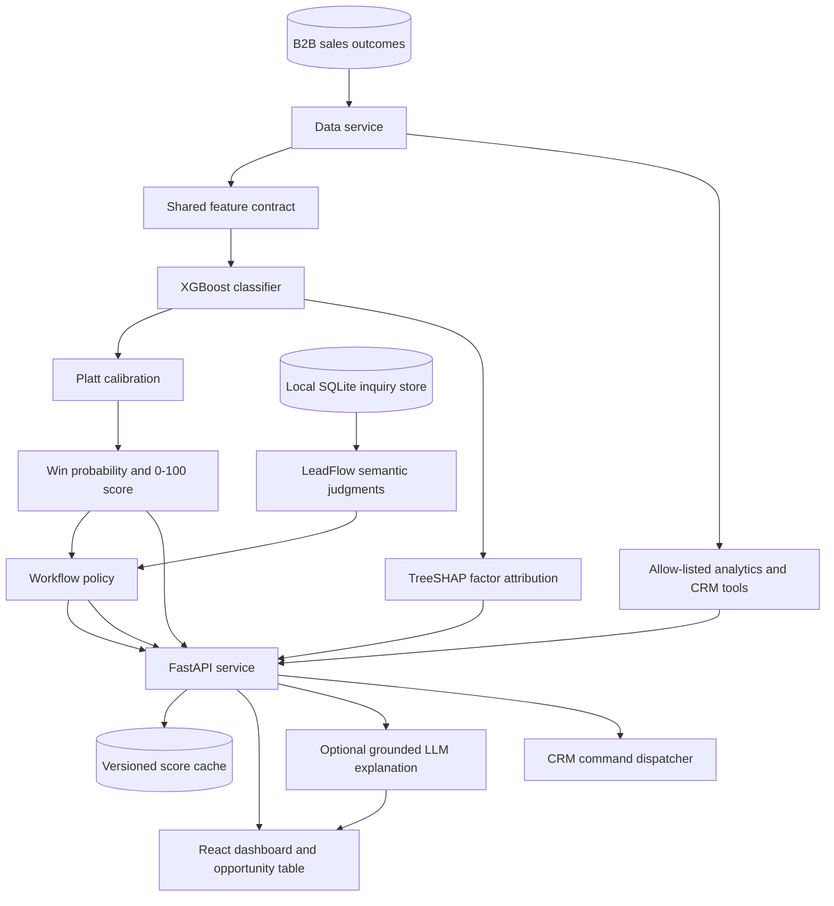

# Hybrid ML + GenAI B2B Opportunity Prioritization

A full-stack sales-prioritization system that ranks B2B opportunities by their
calibrated probability of closing as won. XGBoost owns the score, TreeSHAP
provides model-grounded factors, deterministic policy code selects the next
action, and an optional LLM turns verified evidence into a concise narrative.

## What the system solves

Sales teams have limited review capacity and need a consistent way to focus on
the opportunities most likely to convert. This application converts historical
sales outcomes and qualification-time attributes into an auditable 0–100 score,
a prioritized workflow, and portfolio-level analytics.

The application provides:

- Calibrated win probabilities and 0–100 opportunity scores
- Batch scoring for selected opportunities
- Positive and negative TreeSHAP factors for every prediction
- Capacity-based routing to sales review, nurture, or low priority
- Optional Claude explanations grounded in the score, factors, and policy
- Verified conversational analytics over the complete matching population
- A React dashboard for model metrics, portfolio analytics, and scoring
- Versioned, input-hashed score caching with atomic local persistence
- Health and model-card endpoints for operational visibility
- LeadFlow inquiry classification into quote, qualification, nurture, support,
  do-not-contact, and human-review queues
- A confirmation-gated CRM command bar backed by an allow-listed tool registry

## Architecture



The prediction and explanation paths have separate responsibilities. The LLM
receives an immutable model score, verified factors, observed fields, and the
policy decision. It produces narrative text only; it cannot create or modify a
probability or routing action.

See [docs/hybrid-architecture.md](docs/hybrid-architecture.md) for the detailed
runtime flow and component contracts.

## Components

| Component | Responsibility |
| --- | --- |
| React frontend | Model dashboard, opportunity selection, scores, factors, routing, and analytics chat |
| FastAPI backend | Typed API contracts, orchestration, health checks, and error handling |
| Data service | B2B dataset loading, normalization, pagination, search, and aggregates |
| Feature pipeline | Identical categorical and numerical transformations for training and inference |
| XGBoost model | Opportunity win propensity and ranking |
| Platt calibrator | Maps model margins to calibrated probabilities |
| TreeSHAP layer | Attributes raw model-margin changes to source business features |
| Policy service | Applies capacity thresholds and returns controlled next actions |
| LLM service | Produces optional explanations from verified evidence in a typed response envelope |
| Analytics service | Executes approved filters, groupings, and rankings over all eligible records |
| Score storage | Stores model-versioned and input-hashed results using atomic file replacement |
| Inquiry service | Stores inquiry text, dataset binding, decisions, workflow status, and history in SQLite |
| Jev service | Runs deterministic demo judgments or optional live TypeSafe/Gateway evaluations |
| Workflow policy | Composes semantic judgments with ML evidence into application-owned actions |
| Command service | Maps requests to approved tools, validates arguments, and previews writes |

## Prediction contract

The model estimates:

> P(opportunity is closed-won | attributes available at the qualification snapshot)

The lead score is:

> Lead score = 100 × calibrated win probability

Online model features are:

- Opportunity amount, transformed with `log1p`
- Client revenue band
- Client employee-count band
- Revenue from the client during the previous two years
- Product group and subgroup
- Region
- Route to market
- Competitor status

Outcome and completed-sales-cycle fields are kept outside the online feature
contract. This includes stage duration, stage changes, total-cycle duration,
closing ratios, and the derived deal-size category.

## Dataset

The application uses the public IBM Watson Sales Win/Loss sample:

- 78,025 B2B opportunity rows at ingestion
- 77,970 records after removing 55 exact duplicates
- 17,627 won and 60,398 lost outcomes before deduplication
- Product, geography, route-to-market, amount, client-size, prior-revenue, and
  competitor attributes

The source, checksum, usage note, and field policy are documented in
[backend/data/b2b/README.md](backend/data/b2b/README.md). The sample represents a
single reporting period and does not contain event timestamps, account IDs, or
unstructured communications. Evaluation therefore uses group-disjoint splits
by opportunity number.

## Model training and evaluation

Training uses four group-disjoint partitions:

- 50% training
- 15% validation and XGBoost model selection
- 15% probability calibration and policy-threshold selection
- 20% untouched final testing

The selected XGBoost model is refit on training plus validation data. A separate
Platt calibrator is fitted on calibration data, and the final metrics are then
computed on the untouched test partition.

| Test metric | XGBoost |
| --- | ---: |
| ROC-AUC | 0.8215 |
| Average precision | 0.6211 |
| Brier score | 0.1303 |
| Log loss | 0.4108 |
| Precision at top 10% | 74.0% |
| Top-decile lift | 3.19× |

The complete model card, split sizes, feature contract, thresholds, runtime
versions, and metrics are stored in
[backend/models/b2b_opportunity_model.json](backend/models/b2b_opportunity_model.json).

## Policy and explanations

The calibration population determines two routing thresholds:

- High priority: top 20% of calibrated opportunities, routed to sales review
- Medium priority: above the calibration-set median, routed to nurture
- Low priority: below the calibration-set median

Automated outreach is disabled for every route. The optional LLM endpoint uses
a typed response envelope: score, probability, TreeSHAP factors, model version,
and routing are copied from verified application services. Only the explanation
and missing-information narrative can be language-generated. LLM explanations
are disabled by default so a public deployment cannot spend API credits. Enable
them only on a protected deployment by setting `ENABLE_LLM_EXPLANATIONS=true`
and keeping `ANTHROPIC_API_KEY` in the backend host's secret environment.

## Conversational analytics

The analytics endpoint maps questions to allow-listed operations over the full
eligible dataset. It currently supports:

- Win rate by region
- Win rate by route to market
- Win rate by product group
- Win rate by competitor status
- Highest-value opportunities
- Exact filters for supported dimensions

Every response includes the matching population size, applied filters, source
record IDs when applicable, and the available time-window description.

## LeadFlow and CRM commands

LeadFlow accepts an inquiry linked to an existing opportunity record. The
inquiry is stored with the active dataset checksum so a future dataset change
cannot silently reassign it. Jev-style semantic judgments are kept separate
from the calibrated ML win probability; deterministic workflow policy owns the
resulting action and priority. No inquiry text, outcome label, or completed
sales-cycle field is sent to the ML model, and automated outreach is disabled.

The default provider is `TYPESAFE_MODE=demo`. It is deterministic, offline,
and always labeled as a demo provider in the API and UI. This makes the local
flow and public no-key deployment usable without pretending that a mock result
is live Jev output.

The CRM command bar supports these approved tools: `list_opportunities`,
`show_action_queue`, `score_opportunities`, `explain_opportunity`,
`summarize_portfolio`, and `update_workflow_status`. Numeric record IDs and
categorical values are resolved in Python. Workflow status changes are always
previewed and require an explicit confirmation request.

## API

| Method | Endpoint | Purpose |
| --- | --- | --- |
| `GET` | `/api/opportunities` | Paginated opportunity records with search |
| `GET` | `/api/opportunities/{record_id}` | One opportunity record |
| `POST` | `/api/opportunities/score` | Batch calibrated scoring, factors, and routing |
| `POST` | `/api/opportunities/{record_id}/explanation` | Typed grounded explanation |
| `GET` | `/api/model` | Model card and readiness |
| `POST` | `/api/question` | Verified conversational analytics |
| `POST` | `/api/inquiries` | Create, classify, and route a linked inquiry |
| `GET` | `/api/action-queue` | Filter the LeadFlow inbox |
| `GET` | `/api/inquiries/{inquiry_id}` | Inspect one inquiry decision trail |
| `POST` | `/api/inquiries/{inquiry_id}/status` | Update one local workflow status |
| `POST` | `/api/commands` | Interpret and execute an approved CRM command |
| `POST` | `/api/commands/confirm` | Apply a previewed status change |
| `GET` | `/api/stats` | Portfolio aggregates |
| `GET` | `/api/scores` | Current-model cached scores |
| `GET` | `/api/health` | Data, ML model, and optional LLM health |

Example batch score request:

```bash
curl -X POST http://localhost:8000/api/opportunities/score \
  -H 'Content-Type: application/json' \
  -d '{"record_ids":[1,2,3]}'
```

## Run locally

### Backend

```bash
python3 -m venv backend/venv
source backend/venv/bin/activate
pip install -r backend/requirements.txt
uvicorn app.main:app --app-dir backend --reload --port 8000
```

The scoring and analytics paths do not require an LLM key. To enable generated
explanations, copy `backend/env.example` to `backend/.env` and set
`ANTHROPIC_API_KEY` and `ENABLE_LLM_EXPLANATIONS=true`. CORS origins can be
configured with `CORS_ALLOWED_ORIGINS`. Never use an `ANTHROPIC_API_KEY` or any
other secret in a `REACT_APP_*` variable: Create React App embeds those values
in the downloadable browser bundle.

### Optional live Jev through Vercel AI Gateway

Direct TypeSafe API access is optional and requires `TYPESAFE_API_KEY`. When
that access is waitlisted, the supported live path is Vercel AI Gateway's
evaluation model `typesafe-ai/jev`. Evaluation uses AI SDK 7's
`experimental_evaluate`, not `generateText`; the server adapter normalizes
Gateway's boolean answers to this API's Noul contract and records that
confidence was computed by the adapter from the returned distribution.

For a local one-request smoke test, create the ignored file
`frontend/.env.local`:

```bash
AI_GATEWAY_API_KEY=your-vercel-gateway-key
```

Then run:

```bash
npm --prefix frontend run test:jev-gateway
```

The command prints only the returned model, sample classification,
probabilities, and token usage. It never prints the key. The React browser does
not use this variable.

For a deployed live configuration, set `AI_GATEWAY_API_KEY` and a new random
`JEV_ADAPTER_TOKEN` as Vercel server environment variables. Set the same
`JEV_ADAPTER_TOKEN` on Render, plus:

```bash
TYPESAFE_MODE=gateway
JEV_GATEWAY_ADAPTER_URL=https://genai-lead-scoring-agent.vercel.app/api/jev
```

The adapter rejects requests without the shared token, caps state at 20 KB and
questions at 12, uses a 15-second timeout, and does not log inquiry state or
credentials. Keep `AI_GATEWAY_API_KEY` out of Git, frontend source, and all
`REACT_APP_*` variables. If you leave `TYPESAFE_MODE=demo`, no Gateway credit
is used and all decisions remain clearly labeled deterministic demo output.

### Frontend

```bash
cd frontend
npm install
npm start
```

The frontend uses `/api` by default. Set `REACT_APP_API_URL` when the backend is
hosted separately.

## Deployment

The hosted application uses two services:

- Vercel builds the React application from `frontend/`.
- Render runs the FastAPI application with
  `uvicorn app.main:app --app-dir backend --host 0.0.0.0 --port $PORT`.

`frontend/.env.production` points Vercel builds at the Render API. The backend
allows localhost plus deployment URLs belonging to this project's Vercel name;
override `CORS_ALLOWED_ORIGINS` or `CORS_ALLOWED_ORIGIN_REGEX` when using a
different domain.

The frontend and backend must be deployed from the same revision. Verify a
deployment before testing the UI:

```bash
curl https://genai-lead-scoring-agent.onrender.com/api/health
curl https://genai-lead-scoring-agent.onrender.com/api/model
```

The health response should report 77,970 data records and an operational ML
model. A `404` from `/api/model` means Render is still running the retired lead
API and must be redeployed from the current `master` branch.

For anonymous access, share the public production domain:
`https://genai-lead-scoring-agent.vercel.app/`. Deployment-specific preview
URLs can remain protected by Vercel Authentication and should not be used as
the public link. If the production domain is ever protected, limit any change
under the project's Deployment Protection settings to production access rather
than making private previews public.

The public frontend contains only the Render API URL. Keep
`ENABLE_LLM_EXPLANATIONS=false` on the public backend and remove
`ANTHROPIC_API_KEY` from that Render service. The scoring and verified analytics
paths remain fully functional without it. The public API does not expose a cache
deletion operation, and scoring requests are capped at the 20 records visible on
one UI page.

## Train the model

From the repository root:

```bash
python3 backend/scripts/train_model.py
```

Training regenerates both the deployable model artifact and its JSON model card.
The shared feature module is used by training and online inference to prevent
schema drift.

## Verification

```bash
PYTHONPATH=backend python3 -m unittest discover -s backend/tests -v
npm --prefix frontend run build
npm --prefix frontend run test:adapter
```

The test suite covers dataset normalization, leakage exclusions, calibrated
scoring, source-level TreeSHAP factors, cache invalidation, policy safety,
analytics scope, LeadFlow labels and routing, command arguments and scope,
preview-before-apply status changes, Gateway adapter normalization, health,
and the end-to-end HTTP contract. The live smoke test is intentionally
separate because it consumes one Gateway request and needs a user-owned key.

## Repository structure

```text
backend/
  app/
    api/                   FastAPI routes
    ml/                    Shared feature contract
    services/              Data, scoring, LeadFlow, policy, LLM, analytics, commands, and cache
  data/b2b/                Active B2B dataset and source documentation
  models/                  Trained XGBoost artifact and model card
  scripts/train_model.py   Reproducible training pipeline
  tests/                   Service and HTTP contract tests
frontend/
  src/                     React dashboard and API client
  api/jev.js               Server-only Vercel Gateway evaluation adapter
  scripts/test-jev-gateway.js  One-request live Gateway smoke test
docs/
  hybrid-architecture.md   Detailed current architecture
```
