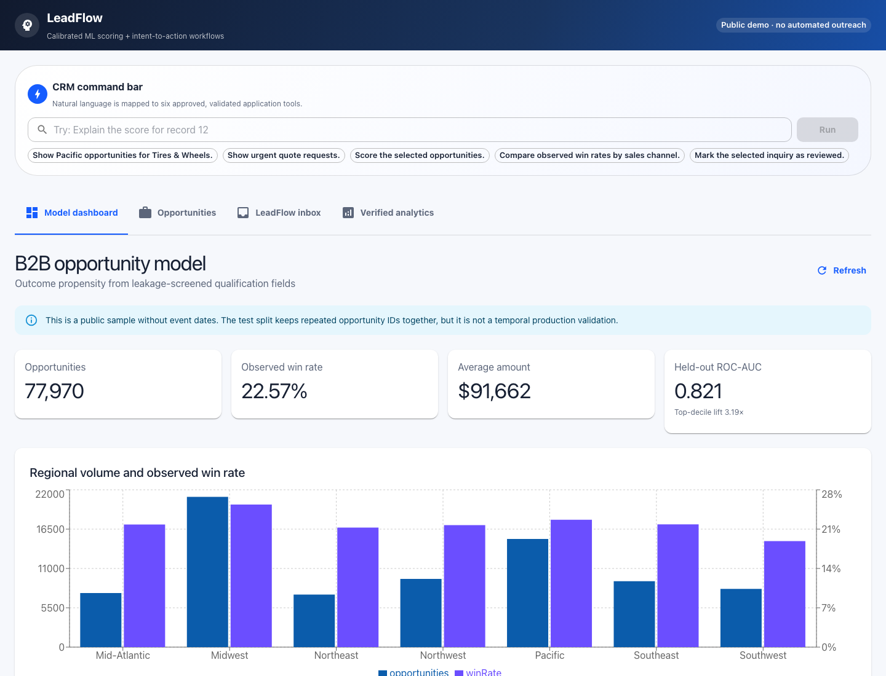
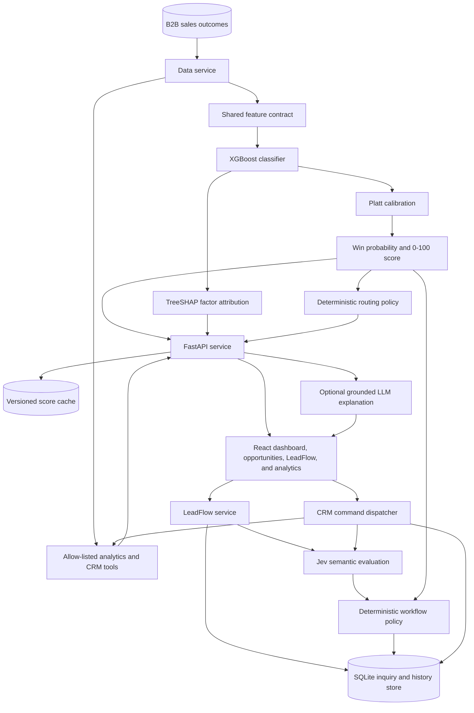
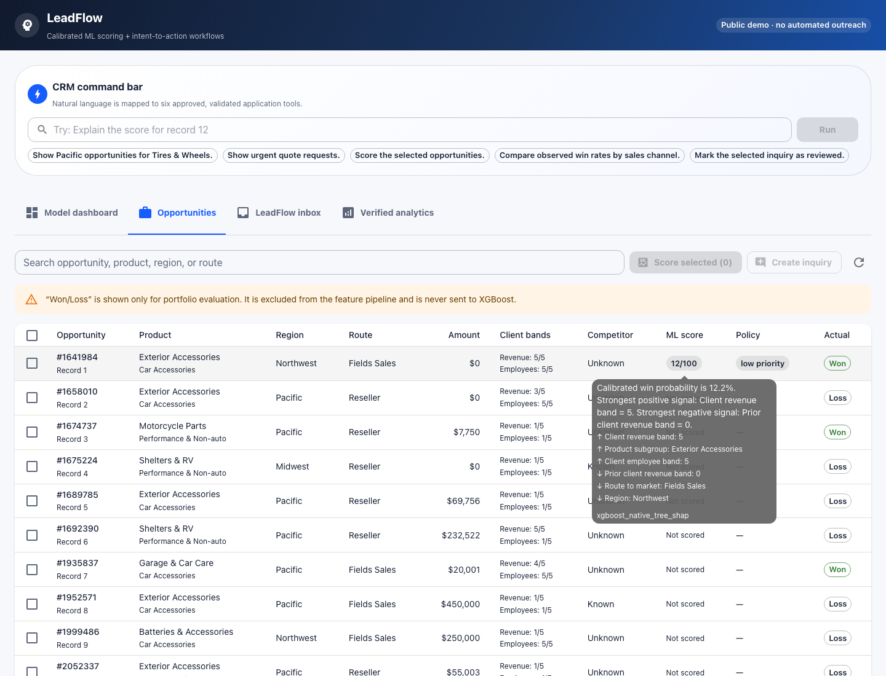
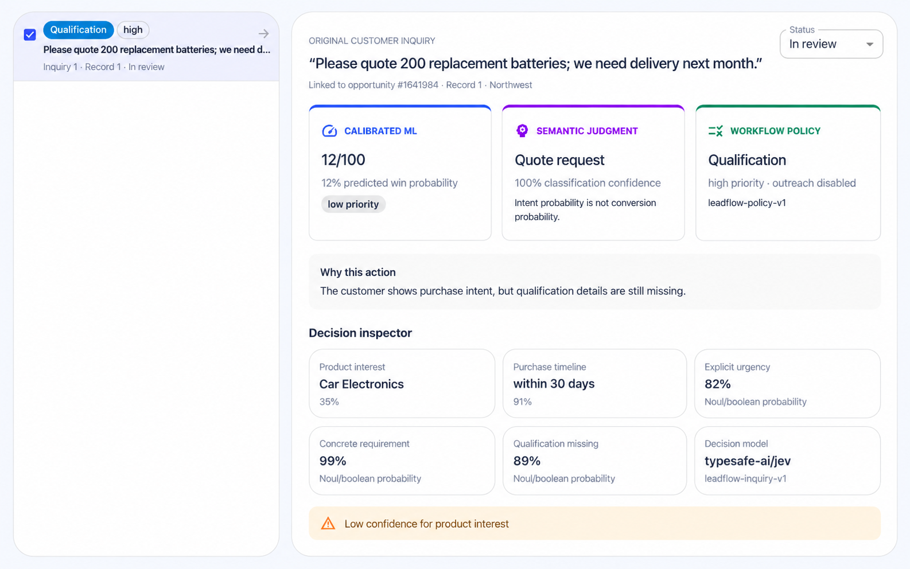
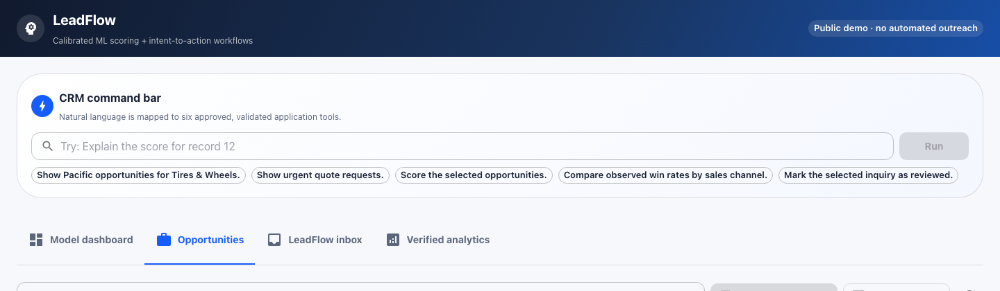
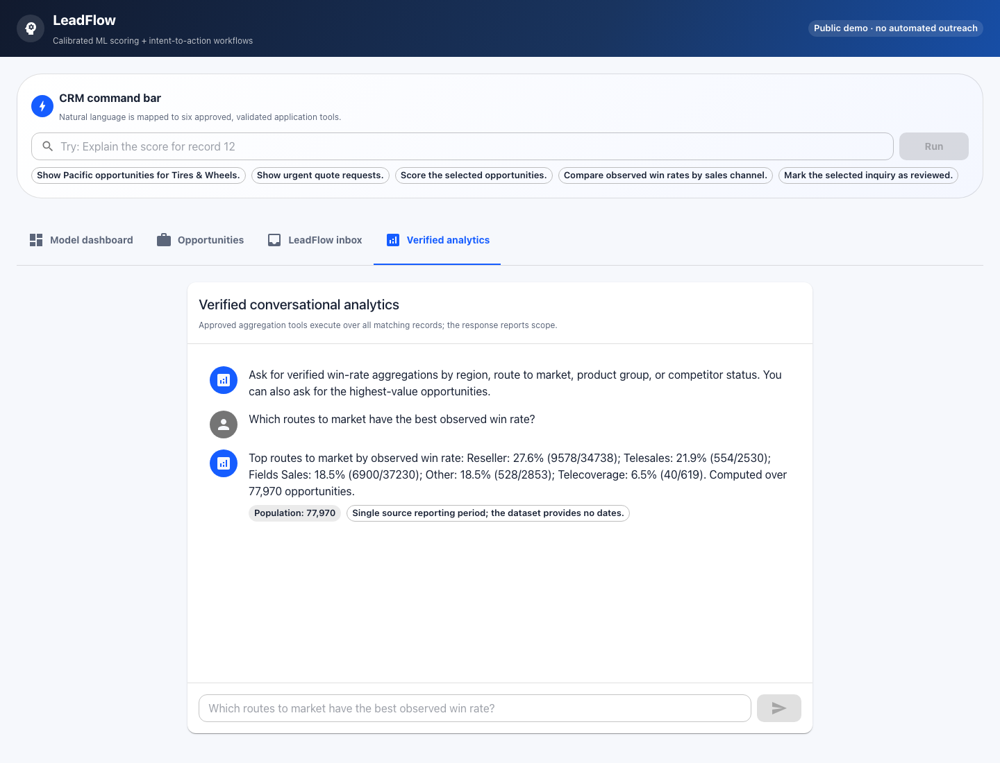

# LeadFlow: Calibrated ML Scoring + Jev Intent-to-Action Workflows

A full-stack sales workflow that combines calibrated B2B opportunity scoring,
Jev-backed inquiry classification, deterministic action queues, and a
constrained natural-language CRM command bar. XGBoost owns the win score,
TreeSHAP provides model-grounded factors, Jev supplies semantic judgments, and
application policy owns every workflow action and write.

## What the system solves

Sales teams have limited review capacity and need a consistent way to focus on
the opportunities most likely to convert. This application converts historical
sales outcomes and qualification-time attributes into an auditable 0–100 score,
a prioritized workflow, and portfolio-level analytics.

## Product capabilities

| Product area | What users can do | Evidence and control |
| --- | --- | --- |
| Model dashboard | Review the source population, observed business outcomes, held-out ROC-AUC, lift, feature contract, and active model version | Metrics come from the persisted model card and dataset aggregates |
| Opportunity workbench | Search and page through 77,970 opportunities, select up to 20 records, run batch scoring, and open a selected record in LeadFlow | Calibrated XGBoost owns the 0–100 score; deterministic policy owns priority and next action |
| Model inspection | View predicted win probability, positive and negative TreeSHAP factors, routing explanation, and cache/model versions | Factors are derived from the model margin and aggregated back to source business fields |
| LeadFlow inbox | Attach an inquiry to an opportunity, classify it, filter six action queues, inspect uncertainty and disagreements, and manage workflow status | Jev supplies semantic judgments; Python policy owns the action, priority, reason, and outreach prohibition |
| CRM command bar | Use natural language to retrieve, inspect, score, summarize, and update supported records with current UI selection as context | Jev selects from six approved tools; Python validates arguments, executes tools, and requires confirmation before command-driven writes |
| Verified analytics | Ask for supported win-rate comparisons, exact-filter summaries, and highest-value opportunities | Deterministic calculations run over the complete matching population and report their scope |
| Grounded explanations | Request an optional narrative of an opportunity score and missing information | The language model can write narrative text only; the application preserves the score, factors, model version, and routing |
| Reliability and security | Check health/model readiness, reuse versioned scores and semantic decisions, and operate the public demo without browser-visible credentials | Typed API contracts, input hashes, dataset checksums, atomic persistence, CORS restrictions, request limits, and server-only secrets protect trust boundaries |



## Architecture



The prediction and explanation paths have separate responsibilities. The LLM
receives an immutable model score, verified factors, observed fields, and the
policy decision. It produces narrative text only; it cannot create or modify a
probability or routing action.

See [docs/hybrid-architecture.md](docs/hybrid-architecture.md) for the detailed
runtime flow and component contracts.

## Components

| Component | Responsibility |
| --- | --- |
| React frontend | Model dashboard, opportunity workbench, score-factor inspection, LeadFlow composer and inbox, command bar, and verified analytics |
| FastAPI backend | Typed API contracts, orchestration, health checks, and error handling |
| Data service | B2B dataset loading, normalization, pagination, search, and aggregates |
| Feature pipeline | Identical categorical and numerical transformations for training and inference |
| XGBoost model | Opportunity win propensity and ranking |
| Platt calibrator | Maps model margins to calibrated probabilities |
| TreeSHAP layer | Attributes raw model-margin changes to source business features |
| Policy service | Applies capacity thresholds and returns controlled next actions |
| LLM service | Produces optional explanations from verified evidence in a typed response envelope |
| Analytics service | Executes approved filters, groupings, and rankings over all eligible records |
| Score storage | Stores model-versioned and input-hashed results using atomic file replacement |
| Inquiry service | Stores inquiry text, dataset binding, decisions, workflow status, and history in SQLite |
| Jev service | Runs deterministic demo judgments or optional live TypeSafe/Gateway evaluations |
| Vercel Jev adapter | Authenticates server-to-server requests, calls AI SDK evaluation, constrains payloads, and normalizes Gateway responses |
| Workflow policy | Composes semantic judgments with ML evidence into application-owned actions |
| Command service | Maps requests to approved tools, validates arguments, and previews writes |
| Public-write guard | Applies per-client request limits to anonymous inquiry, command, confirmation, and status writes |

## Where Jev is useful

Jev is used for two bounded semantic decisions:

1. **Inquiry understanding.** One evaluation asks independent questions over a
   shared inquiry state: main intent, catalog product interest, purchase
   timeline, explicit urgency, concrete purchase requirement, and missing
   qualification information. Choice answers retain their probability
   distributions; boolean/Noul answers retain their probability.
2. **CRM command interpretation.** One evaluation selects one of six approved
   tools and supported categorical arguments such as region, product group,
   action queue, workflow status, or summary dimension.

Jev does **not** calculate or modify the ML win probability, TreeSHAP factors,
workflow action, analytics result, opportunity data, or workflow status. Python
parses record and inquiry IDs, validates every argument, executes the selected
allow-listed tool, and requires a separate confirmation request before a
command can change status. This keeps probabilistic language understanding
separate from deterministic business logic and side effects.

## User workflows

### Review and score an opportunity

1. Open **Opportunities**, search or page through the dataset, and select one
   or more rows.
2. Choose **Score selected** to run local calibrated XGBoost inference.
3. Review the 0–100 score and policy action. Hover over the score chip in the
   Opportunities table to inspect the deterministic explanation and TreeSHAP
   factors.
4. With exactly one row selected, choose **Create inquiry**. LeadFlow opens with
   the record ID prefilled and a confirmation banner showing opportunity,
   product, region, and route-to-market context.



### Classify and route an inquiry

1. Enter non-sensitive inquiry text and choose **Classify & route**.
2. Jev returns semantic judgments; the existing ML service independently
   supplies the linked opportunity score.
3. Python workflow policy composes both inputs into quote request,
   qualification, nurture, support, do-not-contact, or human-review action.
4. Inspect the original text, separate ML/Jev/policy cards, reason, uncertainty,
   disagreement, provider/model, and question/policy versions.
5. Filter queues and statuses or update a status directly in the inbox. Direct
   inbox status changes apply immediately; command-bar status changes use the
   preview-and-confirm flow.



### Use the CRM command bar

The persistent command bar exposes this allow-listed registry:

| Tool | Supported operation | Safety behavior |
| --- | --- | --- |
| `list_opportunities` | Filter opportunities by supported dataset dimensions | Reports matching population, returned count, and whether the result is complete |
| `show_action_queue` | Retrieve LeadFlow items by action and urgency | Uses persisted inquiry decisions and returns explicit queue scope |
| `score_opportunities` | Score selected records or explicit record IDs | Requires valid IDs and limits a command to 20 records |
| `explain_opportunity` | Return the existing score, TreeSHAP factors, and routing for one record | Uses model-owned evidence; optional narrative generation cannot replace it |
| `summarize_portfolio` | Compare approved win-rate dimensions or rank opportunities | Calculates over the full matching dataset population |
| `update_workflow_status` | Change selected inquiries to a supported workflow status | Creates a single-use preview token and writes only after **Confirm change** |

Selection-aware commands can use checked opportunities or inquiries. Explicit
record and inquiry IDs are parsed deterministically. Results show the chosen
tool, confidence, interpreted arguments, matching scope, and every record
returned by the backend. Unsupported dates, missing IDs, invalid IDs, unclear
intent, and low-confidence tool choices produce clarification instead of an
unsafe guess. Status writes create a server-side preview token and remain
unchanged until **Confirm change** is selected.



### Ask verified analytics questions

The **Verified analytics** pane supports allow-listed portfolio summaries,
highest-value opportunities, and observed win rates by region, route to market,
product group, or competitor status. Its calculations are deterministic and do
not call Jev or an explanation LLM.



## Prediction contract

The model estimates:

> P(opportunity is closed-won | attributes available at the qualification snapshot)

The lead score is:

> Lead score = 100 × calibrated win probability

Online model features are:

- Opportunity amount, transformed with `log1p`
- Client revenue band
- Client employee-count band
- Revenue from the client during the previous two years
- Product group and subgroup
- Region
- Route to market
- Competitor status

Outcome and completed-sales-cycle fields are kept outside the online feature
contract. This includes stage duration, stage changes, total-cycle duration,
closing ratios, and the derived deal-size category.

## Dataset

The application uses the public IBM Watson Sales Win/Loss sample:

- 78,025 B2B opportunity rows at ingestion
- 77,970 records after removing 55 exact duplicates
- 17,627 won and 60,398 lost outcomes before deduplication
- Product, geography, route-to-market, amount, client-size, prior-revenue, and
  competitor attributes

The source, checksum, usage note, and field policy are documented in
[backend/data/b2b/README.md](backend/data/b2b/README.md). The sample represents a
single reporting period and does not contain event timestamps, account IDs, or
unstructured communications. Evaluation therefore uses group-disjoint splits
by opportunity number.

LeadFlow semantic and policy behavior is exercised against 36 labeled synthetic
inquiries spanning quote requests, product-fit questions, research, support,
opt-out, and ambiguous messages. These fixtures are independent of historical
win/loss labels and live in
[`backend/data/leadflow_synthetic_inquiries.json`](backend/data/leadflow_synthetic_inquiries.json).

## Model training and evaluation

Training uses four group-disjoint partitions:

- 50% training
- 15% validation and XGBoost model selection
- 15% probability calibration and policy-threshold selection
- 20% untouched final testing

The selected XGBoost model is refit on training plus validation data. A separate
Platt calibrator is fitted on calibration data, and the final metrics are then
computed on the untouched test partition.

| Test metric | XGBoost |
| --- | ---: |
| ROC-AUC | 0.8215 |
| Average precision | 0.6211 |
| Brier score | 0.1303 |
| Log loss | 0.4108 |
| Precision at top 10% | 74.0% |
| Top-decile lift | 3.19× |

The complete model card, split sizes, feature contract, thresholds, runtime
versions, and metrics are stored in
[backend/models/b2b_opportunity_model.json](backend/models/b2b_opportunity_model.json).

## Policy and explanations

The calibration population determines two routing thresholds:

- High priority: top 20% of calibrated opportunities, routed to sales review
- Medium priority: above the calibration-set median, routed to nurture
- Low priority: below the calibration-set median

Automated outreach is disabled for every route. The optional LLM endpoint uses
a typed response envelope: score, probability, TreeSHAP factors, model version,
and routing are copied from verified application services. Only the explanation
and missing-information narrative can be language-generated. LLM explanations
are disabled by default so a public deployment cannot spend API credits. Enable
them only on a protected deployment by setting `ENABLE_LLM_EXPLANATIONS=true`
and keeping `ANTHROPIC_API_KEY` in the backend host's secret environment.

## Conversational analytics

The analytics endpoint maps questions to allow-listed operations over the full
eligible dataset. It currently supports:

- Win rate by region
- Win rate by route to market
- Win rate by product group
- Win rate by competitor status
- Highest-value opportunities
- Exact filters for supported dimensions

Every response includes the matching population size, applied filters, source
record IDs when applicable, and the available time-window description.

## LeadFlow and CRM commands

LeadFlow accepts an inquiry linked to an existing opportunity record. The
inquiry is stored with the active dataset checksum so a future dataset change
cannot silently reassign it. Jev-style semantic judgments are kept separate
from the calibrated ML win probability; deterministic workflow policy owns the
resulting action and priority. No inquiry text, outcome label, or completed
sales-cycle field is sent to the ML model, and automated outreach is disabled.

The default provider is `TYPESAFE_MODE=demo`. It is deterministic, offline,
and always labeled as a demo provider in the API and UI. This makes the local
flow and public no-key deployment usable without pretending that a mock result
is live Jev output.

The CRM command bar supports these approved tools: `list_opportunities`,
`show_action_queue`, `score_opportunities`, `explain_opportunity`,
`summarize_portfolio`, and `update_workflow_status`. Numeric record IDs and
categorical values are resolved in Python. Workflow status changes are always
previewed and require an explicit confirmation request.

## API

| Method | Endpoint | Purpose |
| --- | --- | --- |
| `GET` | `/api/opportunities` | Paginated opportunity records with search |
| `GET` | `/api/opportunities/{record_id}` | One opportunity record |
| `POST` | `/api/opportunities/score` | Batch calibrated scoring, factors, and routing |
| `POST` | `/api/opportunities/{record_id}/explanation` | Typed grounded explanation |
| `GET` | `/api/model` | Model card and readiness |
| `POST` | `/api/question` | Verified conversational analytics |
| `POST` | `/api/inquiries` | Create, classify, and route a linked inquiry |
| `GET` | `/api/action-queue` | Filter the LeadFlow inbox |
| `GET` | `/api/inquiries/{inquiry_id}` | Inspect one inquiry decision trail |
| `POST` | `/api/inquiries/{inquiry_id}/status` | Update one local workflow status |
| `POST` | `/api/commands` | Interpret and execute an approved CRM command |
| `POST` | `/api/commands/confirm` | Apply a previewed status change |
| `GET` | `/api/stats` | Portfolio aggregates |
| `GET` | `/api/scores` | Current-model cached scores |
| `GET` | `/api/health` | Data, ML model, and optional LLM health |

Example batch score request:

```bash
curl -X POST http://localhost:8000/api/opportunities/score \
  -H 'Content-Type: application/json' \
  -d '{"record_ids":[1,2,3]}'
```

## Run locally

### Backend

```bash
python3 -m venv backend/venv
source backend/venv/bin/activate
pip install -r backend/requirements.txt
uvicorn app.main:app --app-dir backend --reload --port 8000
```

The scoring and analytics paths do not require an LLM key. To enable generated
explanations, copy `backend/env.example` to `backend/.env` and set
`ANTHROPIC_API_KEY` and `ENABLE_LLM_EXPLANATIONS=true`. CORS origins can be
configured with `CORS_ALLOWED_ORIGINS`. Never use an `ANTHROPIC_API_KEY` or any
other secret in a `REACT_APP_*` variable: Create React App embeds those values
in the downloadable browser bundle.

### Optional live Jev through Vercel AI Gateway

Direct TypeSafe API access is optional and requires `TYPESAFE_API_KEY`. Vercel
AI Gateway provides the supported hosted-provider path through evaluation model
`typesafe-ai/jev`. Evaluation uses AI SDK 7's
`experimental_evaluate`, not `generateText`; the server adapter normalizes
Gateway's boolean answers to this API's Noul contract and records that
confidence was computed by the adapter from the returned distribution.

For a local one-request smoke test, create the ignored file
`frontend/.env.local`:

```bash
AI_GATEWAY_API_KEY=your-vercel-gateway-key
```

Then run:

```bash
npm --prefix frontend run test:jev-gateway
```

The command prints only the returned model, sample classification,
probabilities, and token usage. It never prints the key. The React browser does
not use this variable.

For the complete local browser flow, keep the key only in the same ignored
`frontend/.env.local` and start three terminals from the repository root:

```bash
# Terminal 1: server-only AI SDK adapter on 127.0.0.1:3001
npm --prefix frontend run serve:jev-local
```

```bash
# Terminal 2: FastAPI using the protected local adapter
TYPESAFE_MODE=gateway \
JEV_GATEWAY_ADAPTER_URL=http://127.0.0.1:3001/api/jev \
JEV_ADAPTER_TOKEN=local-dev-only \
./start_backend.sh
```

```bash
# Terminal 3: React UI pinned to port 3000
PORT=3000 ./start_frontend.sh
```

Open `http://localhost:3000` and verify `http://127.0.0.1:8000/api/health`
reports Jev mode `gateway`, model `typesafe-ai/jev`, and `demo: false`. Each
new inquiry classification and each CRM command consumes one Gateway
evaluation. Reading queues, scoring with XGBoost, applying an already-issued
confirmation, and using verified analytics do not consume Jev credits.

For a deployed live configuration, set `AI_GATEWAY_API_KEY` and a new random
`JEV_ADAPTER_TOKEN` as Vercel server environment variables. Set the same
`JEV_ADAPTER_TOKEN` on Render, plus:

```bash
TYPESAFE_MODE=gateway
JEV_GATEWAY_ADAPTER_URL=https://genai-lead-scoring-agent.vercel.app/api/jev
```

The adapter rejects requests without the shared token, caps state at 20 KB and
questions at 12, uses a 15-second timeout, and does not log inquiry state or
credentials. Keep `AI_GATEWAY_API_KEY` out of Git, frontend source, and all
`REACT_APP_*` variables. If you leave `TYPESAFE_MODE=demo`, no Gateway credit
is used and all decisions remain clearly labeled deterministic demo output.

### Frontend

```bash
cd frontend
npm install
npm start
```

The frontend uses `/api` by default. Set `REACT_APP_API_URL` when the backend is
hosted separately.

## Deployment

The hosted application uses two services:

- Vercel builds the React application from `frontend/`.
- Render runs the FastAPI application with
  `uvicorn app.main:app --app-dir backend --host 0.0.0.0 --port $PORT`.

`frontend/.env.production` points Vercel builds at the Render API. The backend
allows any `localhost` or `127.0.0.1` development port plus deployment URLs
belonging to this project's Vercel name; override `CORS_ALLOWED_ORIGINS` or
`CORS_ALLOWED_ORIGIN_REGEX` when using a different domain.

Deploy the frontend and backend from the same revision. The public services
are:

- Application: `https://genai-lead-scoring-agent.vercel.app/`
- API: `https://genai-lead-scoring-agent.onrender.com/api`

Verify service readiness before testing the UI:

```bash
curl https://genai-lead-scoring-agent.onrender.com/api/health
curl https://genai-lead-scoring-agent.onrender.com/api/model
```

The health response reports data and model readiness, LeadFlow storage status,
the public-write guard, and the active Jev transport. In the live Gateway
configuration, it reports model `typesafe-ai/jev` with `demo: false`.

The public frontend contains only the Render API URL. The public backend uses
`ENABLE_LLM_EXPLANATIONS=false` and does not configure `ANTHROPIC_API_KEY`.
Scoring and verified analytics remain fully functional without that optional
provider. The public API does not expose a cache deletion operation, and
scoring requests are capped at the 20 records visible on one UI page.

## Train the model

From the repository root:

```bash
python3 backend/scripts/train_model.py
```

Training regenerates both the deployable model artifact and its JSON model card.
The shared feature module is used by training and online inference to prevent
schema drift.

## Verification

```bash
PYTHONPATH=backend python3 -m unittest discover -s backend/tests -v
npm --prefix frontend run build
npm --prefix frontend run test:adapter
```

The test suite covers dataset normalization, leakage exclusions, calibrated
scoring, source-level TreeSHAP factors, cache invalidation, policy safety,
analytics scope, LeadFlow labels and routing, command arguments and scope,
preview-before-apply status changes, Gateway adapter normalization, health,
and the end-to-end HTTP contract. The live smoke test is intentionally
separate because it consumes one Gateway request and needs a user-owned key.

## Repository structure

```text
backend/
  app/
    api/                   FastAPI routes
    ml/                    Shared feature contract
    services/              Data, scoring, LeadFlow, policy, LLM, analytics, commands, and cache
  data/b2b/                Active B2B dataset and source documentation
  data/leadflow_synthetic_inquiries.json  Labeled LeadFlow behavior fixtures
  models/                  Trained XGBoost artifact and model card
  scripts/train_model.py   Reproducible training pipeline
  tests/                   Service and HTTP contract tests
frontend/
  src/                     React dashboard and API client
  api/jev.js               Server-only Vercel Gateway evaluation adapter
  scripts/test-jev-gateway.js  One-request live Gateway smoke test
docs/
  hybrid-architecture.md   System architecture and decision contracts
  images/                  Product screenshots used by this README
```
