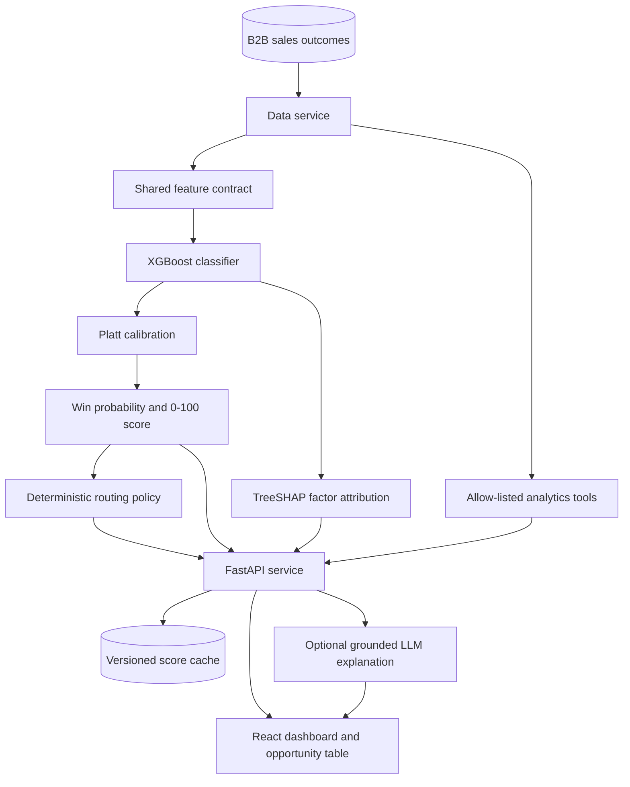

# Hybrid ML + GenAI B2B Opportunity Prioritization

A full-stack sales-prioritization system that ranks B2B opportunities by their
calibrated probability of closing as won. XGBoost owns the score, TreeSHAP
provides model-grounded factors, deterministic policy code selects the next
action, and an optional LLM turns verified evidence into a concise narrative.

## What the system solves

Sales teams have limited review capacity and need a consistent way to focus on
the opportunities most likely to convert. This application converts historical
sales outcomes and qualification-time attributes into an auditable 0–100 score,
a prioritized workflow, and portfolio-level analytics.

The application provides:

- Calibrated win probabilities and 0–100 opportunity scores
- Batch scoring for selected opportunities
- Positive and negative TreeSHAP factors for every prediction
- Capacity-based routing to sales review, nurture, or low priority
- Optional Claude explanations grounded in the score, factors, and policy
- Verified conversational analytics over the complete matching population
- A React dashboard for model metrics, portfolio analytics, and scoring
- Versioned, input-hashed score caching with atomic local persistence
- Health and model-card endpoints for operational visibility

## Architecture



The prediction and explanation paths have separate responsibilities. The LLM
receives an immutable model score, verified factors, observed fields, and the
policy decision. It produces narrative text only; it cannot create or modify a
probability or routing action.

See [docs/hybrid-architecture.md](docs/hybrid-architecture.md) for the detailed
runtime flow and component contracts.

## Components

| Component | Responsibility |
| --- | --- |
| React frontend | Model dashboard, opportunity selection, scores, factors, routing, and analytics chat |
| FastAPI backend | Typed API contracts, orchestration, health checks, and error handling |
| Data service | B2B dataset loading, normalization, pagination, search, and aggregates |
| Feature pipeline | Identical categorical and numerical transformations for training and inference |
| XGBoost model | Opportunity win propensity and ranking |
| Platt calibrator | Maps model margins to calibrated probabilities |
| TreeSHAP layer | Attributes raw model-margin changes to source business features |
| Policy service | Applies capacity thresholds and returns controlled next actions |
| LLM service | Produces optional explanations from verified evidence in a typed response envelope |
| Analytics service | Executes approved filters, groupings, and rankings over all eligible records |
| Score storage | Stores model-versioned and input-hashed results using atomic file replacement |

## Prediction contract

The model estimates:

> P(opportunity is closed-won | attributes available at the qualification snapshot)

The lead score is:

> Lead score = 100 × calibrated win probability

Online model features are:

- Opportunity amount, transformed with `log1p`
- Client revenue band
- Client employee-count band
- Revenue from the client during the previous two years
- Product group and subgroup
- Region
- Route to market
- Competitor status

Outcome and completed-sales-cycle fields are kept outside the online feature
contract. This includes stage duration, stage changes, total-cycle duration,
closing ratios, and the derived deal-size category.

## Dataset

The application uses the public IBM Watson Sales Win/Loss sample:

- 78,025 B2B opportunity rows at ingestion
- 77,970 records after removing 55 exact duplicates
- 17,627 won and 60,398 lost outcomes before deduplication
- Product, geography, route-to-market, amount, client-size, prior-revenue, and
  competitor attributes

The source, checksum, usage note, and field policy are documented in
[backend/data/b2b/README.md](backend/data/b2b/README.md). The sample represents a
single reporting period and does not contain event timestamps, account IDs, or
unstructured communications. Evaluation therefore uses group-disjoint splits
by opportunity number.

## Model training and evaluation

Training uses four group-disjoint partitions:

- 50% training
- 15% validation and XGBoost model selection
- 15% probability calibration and policy-threshold selection
- 20% untouched final testing

The selected XGBoost model is refit on training plus validation data. A separate
Platt calibrator is fitted on calibration data, and the final metrics are then
computed on the untouched test partition.

| Test metric | XGBoost |
| --- | ---: |
| ROC-AUC | 0.8215 |
| Average precision | 0.6211 |
| Brier score | 0.1303 |
| Log loss | 0.4108 |
| Precision at top 10% | 74.0% |
| Top-decile lift | 3.19× |

The complete model card, split sizes, feature contract, thresholds, runtime
versions, and metrics are stored in
[backend/models/b2b_opportunity_model.json](backend/models/b2b_opportunity_model.json).

## Policy and explanations

The calibration population determines two routing thresholds:

- High priority: top 20% of calibrated opportunities, routed to sales review
- Medium priority: above the calibration-set median, routed to nurture
- Low priority: below the calibration-set median

Automated outreach is disabled for every route. The optional LLM endpoint uses
a typed response envelope: score, probability, TreeSHAP factors, model version,
and routing are copied from verified application services. Only the explanation
and missing-information narrative can be language-generated.

## Conversational analytics

The analytics endpoint maps questions to allow-listed operations over the full
eligible dataset. It currently supports:

- Win rate by region
- Win rate by route to market
- Win rate by product group
- Win rate by competitor status
- Highest-value opportunities
- Exact filters for supported dimensions

Every response includes the matching population size, applied filters, source
record IDs when applicable, and the available time-window description.

## API

| Method | Endpoint | Purpose |
| --- | --- | --- |
| `GET` | `/api/opportunities` | Paginated opportunity records with search |
| `GET` | `/api/opportunities/{record_id}` | One opportunity record |
| `POST` | `/api/opportunities/score` | Batch calibrated scoring, factors, and routing |
| `POST` | `/api/opportunities/{record_id}/explanation` | Typed grounded explanation |
| `GET` | `/api/model` | Model card and readiness |
| `POST` | `/api/question` | Verified conversational analytics |
| `GET` | `/api/stats` | Portfolio aggregates |
| `GET` | `/api/scores` | Current-model cached scores |
| `DELETE` | `/api/scores` | Clear the local score cache |
| `GET` | `/api/health` | Data, ML model, and optional LLM health |

Example batch score request:

```bash
curl -X POST http://localhost:8000/api/opportunities/score \
  -H 'Content-Type: application/json' \
  -d '{"record_ids":[1,2,3]}'
```

## Run locally

### Backend

```bash
python3 -m venv backend/venv
source backend/venv/bin/activate
pip install -r backend/requirements.txt
uvicorn app.main:app --app-dir backend --reload --port 8000
```

The scoring and analytics paths do not require an LLM key. To enable generated
explanations, copy `backend/env.example` to `backend/.env` and set
`ANTHROPIC_API_KEY`. CORS origins can be configured with
`CORS_ALLOWED_ORIGINS`.

### Frontend

```bash
cd frontend
npm install
npm start
```

The frontend uses `/api` by default. Set `REACT_APP_API_URL` when the backend is
hosted separately.

## Train the model

From the repository root:

```bash
python3 backend/scripts/train_model.py
```

Training regenerates both the deployable model artifact and its JSON model card.
The shared feature module is used by training and online inference to prevent
schema drift.

## Verification

```bash
PYTHONPATH=backend python3 -m unittest discover -s backend/tests -v
npm --prefix frontend run build
```

The test suite covers dataset normalization, leakage exclusions, calibrated
scoring, source-level TreeSHAP factors, cache invalidation, policy safety,
analytics scope, health, and the end-to-end HTTP contract.

## Repository structure

```text
backend/
  app/
    api/                   FastAPI routes
    ml/                    Shared feature contract
    services/              Data, scoring, policy, LLM, analytics, and cache
  data/b2b/                Active B2B dataset and source documentation
  models/                  Trained XGBoost artifact and model card
  scripts/train_model.py   Reproducible training pipeline
  tests/                   Service and HTTP contract tests
frontend/
  src/                     React dashboard and API client
docs/
  hybrid-architecture.md   Detailed current architecture
```
