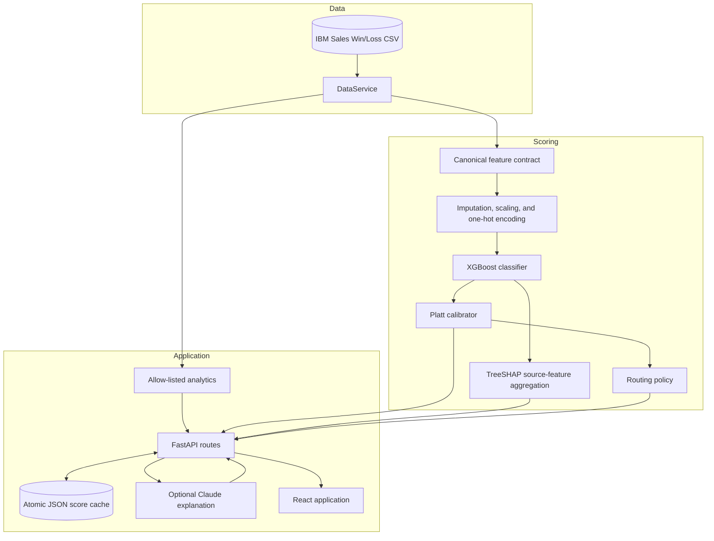
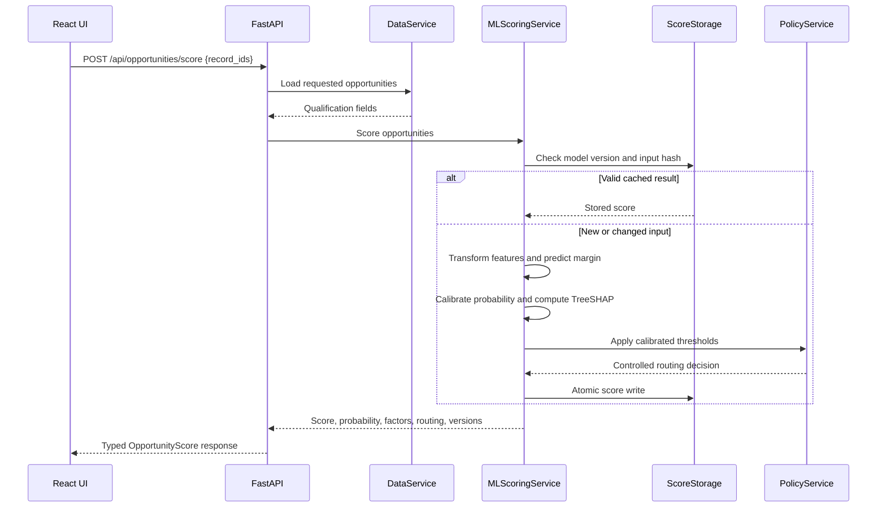

# Current System Architecture

## System objective

The application prioritizes qualified B2B sales opportunities by estimating a
calibrated closed-won probability from qualification-snapshot attributes. It
serves the probability as a 0–100 score, explains the model contribution of each
business feature, and applies a deterministic capacity policy.

## Runtime architecture

## Scoring sequence

## Component contracts

| Component | Inputs | Outputs | Enforced behavior |
| --- | --- | --- | --- |
| `DataService` | Source CSV, pagination, search, filters | Typed opportunity records and aggregates | Read-only access and exact-match supported filters |
| Feature contract | Qualification-time record fields | Ordered model feature frame | Same schema in training and inference |
| XGBoost | Transformed feature matrix | Raw margin and propensity ranking | Outcome and completed-cycle fields are absent |
| Platt calibrator | Raw XGBoost margin | Calibrated probability | Fitted only on the calibration partition |
| TreeSHAP | XGBoost model and transformed row | Positive and negative source-feature factors | One-hot contributions aggregate to source business fields |
| `PolicyService` | Calibrated probability and thresholds | Priority and next action | Deterministic; automated outreach disabled |
| `LLMService` | Immutable score evidence | Explanation and missing-information narrative | Cannot write score, factors, model version, or routing |
| `AnalyticsService` | Natural-language question | Verified aggregate and scope metadata | Uses only allow-listed computations over matching records |
| `ScoreStorage` | Score result | Versioned cached result | Input-hash validation, locking, and atomic replacement |

## Training architecture

The training script performs the following reproducible flow:

1. Verify and load the source dataset.
2. Normalize column names, types, outcomes, and exact duplicates.
3. Split opportunity-number groups into training, validation, calibration, and
   final-test partitions.
4. Fit the preprocessing pipeline on training data.
5. Select the configured XGBoost depth using validation ROC-AUC.
6. Refit preprocessing and XGBoost on training plus validation data.
7. Fit Platt calibration and capacity thresholds on the calibration partition.
8. Evaluate once on the untouched test partition.
9. Persist the model pipeline, calibrator, feature names, thresholds, source
   checksum, runtime versions, and model card.

## Analytics architecture

Conversational analytics is implemented as controlled application tooling. The
question parser selects a supported dimension or ranking operation, extracts
exact supported filters, and executes the calculation over all matching records.
The response reports:

- The computed answer
- Matching population size
- Applied filters
- Source record IDs for ranked opportunities
- The dataset time-window description

## Operational controls

- CORS origins are environment-configured and methods are restricted.
- API keys are loaded from environment variables and are never logged.
- Model readiness and load errors are exposed by the health endpoint.
- Scores are accepted from the calibrated ML service only.
- Cache hits require both the active model version and the exact input hash.
- The outcome is available for evaluation displays but never enters inference.
- LLM output is structurally validated and wrapped with application-owned
  decision fields.
- Score persistence uses a process-local lock, file synchronization, and atomic
  replacement.
