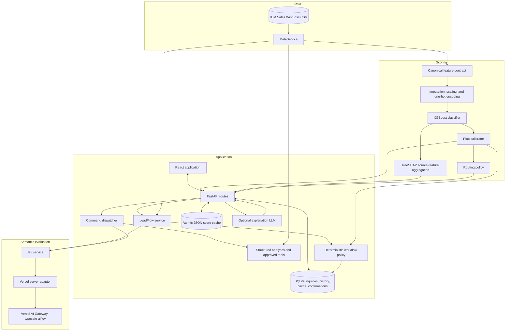
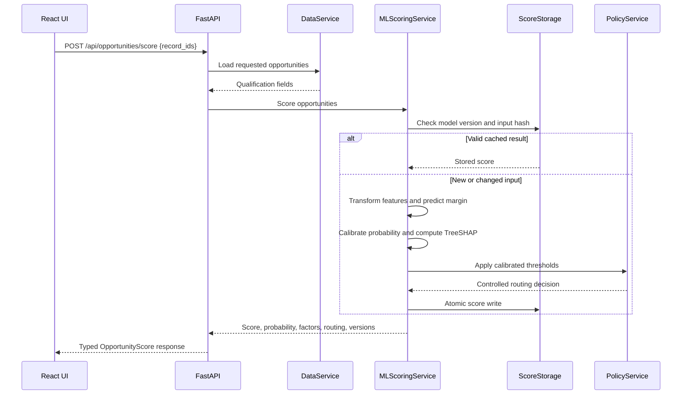
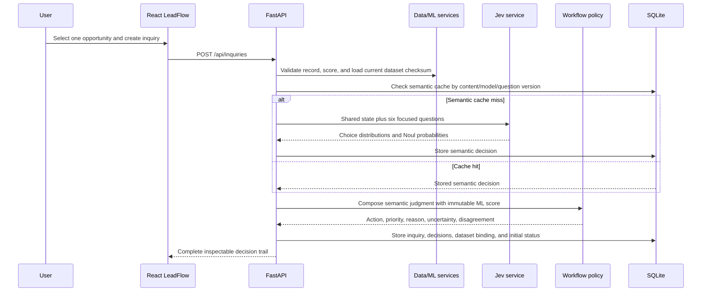

# Current System Architecture

## System objective

The application prioritizes qualified B2B sales opportunities by estimating a
calibrated closed-won probability from qualification-snapshot attributes. It
also classifies user-supplied inquiries into action queues and maps natural
language requests to a six-tool CRM registry. ML, semantic judgment, workflow
policy, and side effects remain separate contracts.

## Runtime architecture



## Scoring sequence



## Component contracts

| Component | Inputs | Outputs | Enforced behavior |
| --- | --- | --- | --- |
| `DataService` | Source CSV, pagination, search, filters | Typed opportunity records and aggregates | Read-only access and exact-match supported filters |
| Feature contract | Qualification-time record fields | Ordered model feature frame | Same schema in training and inference |
| XGBoost | Transformed feature matrix | Raw margin and propensity ranking | Outcome and completed-cycle fields are absent |
| Platt calibrator | Raw XGBoost margin | Calibrated probability | Fitted only on the calibration partition |
| TreeSHAP | XGBoost model and transformed row | Positive and negative source-feature factors | One-hot contributions aggregate to source business fields |
| `PolicyService` | Calibrated probability and thresholds | Priority and next action | Deterministic; automated outreach disabled |
| `LLMService` | Immutable score evidence | Explanation and missing-information narrative | Cannot write score, factors, model version, or routing |
| `AnalyticsService` | Natural-language question | Verified aggregate and scope metadata | Uses only allow-listed computations over matching records |
| `ScoreStorage` | Score result | Versioned cached result | Input-hash validation, locking, and atomic replacement |
| `JevService` | Inquiry or command plus dynamic choices | Typed semantic judgments | Demo, direct live, or protected Gateway mode; never executes a side effect |
| `InquiryService` | Inquiry, decisions, status, confirmation | Dataset-bound records and history | SQLite transactions; confirmation tokens are single-use |
| `LeadFlowService` | Linked record ID and inquiry text | Persisted decision trail | Semantic cache includes content, model, and question version |
| `WorkflowPolicyService` | Jev judgments and immutable ML score | Action, priority, reason, uncertainty | Deterministic; support/opt-out safety overrides; outreach disabled |
| `CommandService` | Jev tool choice, UI selection, explicit IDs | Validated tool result or clarification | Six-tool registry only; Python validates and executes |
| Vercel Jev adapter | Protected evaluation request | Normalized Choice/Noul answers and usage | Server-only key, request caps, timeout, retries, no state logging |

## Training architecture

The training script performs the following reproducible flow:

1. Verify and load the source dataset.
2. Normalize column names, types, outcomes, and exact duplicates.
3. Split opportunity-number groups into training, validation, calibration, and
   final-test partitions.
4. Fit the preprocessing pipeline on training data.
5. Select the configured XGBoost depth using validation ROC-AUC.
6. Refit preprocessing and XGBoost on training plus validation data.
7. Fit Platt calibration and capacity thresholds on the calibration partition.
8. Evaluate once on the untouched test partition.
9. Persist the model pipeline, calibrator, feature names, thresholds, source
   checksum, runtime versions, and model card.

## Analytics architecture

Conversational analytics is implemented as controlled application tooling. The
question parser selects a supported dimension or ranking operation, extracts
exact supported filters, and executes the calculation over all matching records.
The response reports:

- The computed answer
- Matching population size
- Applied filters
- Source record IDs for ranked opportunities
- The dataset time-window description

## LeadFlow architecture

LeadFlow stores user-supplied inquiry text separately from the historical
opportunity dataset. Each inquiry includes the linked record ID, opportunity
number, dataset version, and source checksum. The checksum is checked again on
read, preventing a future reorder or replacement of the CSV from silently
moving an inquiry to a different record.

Jev receives only the inquiry and the current product catalog. Independent
Choice and Noul judgments cover main intent, catalog product interest,
purchase timeline, urgency, concrete purchase requirement, and missing
qualification information. The workflow policy composes these judgments in
Python with the immutable ML score. It can therefore route an opt-out or
support issue correctly even when the opportunity's conversion score is high,
and it can show a high-score/early-research disagreement without confusing the
two probabilities.

`TYPESAFE_MODE=demo` uses deterministic rules and is explicitly marked in the
response. `TYPESAFE_MODE=live` calls TypeSafe's HTTP System One endpoint.
`TYPESAFE_MODE=gateway` calls the protected Vercel `/api/jev` function, which
uses AI SDK 7 `experimental_evaluate` with `typesafe-ai/jev`. The browser never
receives a provider credential. Gateway boolean answers are normalized to the
internal Noul shape, while categorical confidence is computed from the
returned probability distribution and labeled as application-derived.

### Inquiry sequence



Jev is useful here because intent, urgency, missing information, and product
language are semantic rather than tabular. It is not permitted to estimate the
win probability or choose the final action. A low-confidence semantic answer
remains visible; policy can route it to qualification or human review.

## CRM command architecture

The command bar first obtains a constrained tool and categorical-argument
judgment, then Python parses explicit record/inquiry IDs and validates all
arguments against current dataset values. Only the six registered tools can
execute. Analytics commands call structured operations directly; they do not
feed an interpreted command back through the keyword parser. Listing reports
the matching population and returned page, aggregation reports its full
matching population, and date filters are rejected because the source has no
event timestamps. Status updates create a SQLite confirmation record before
any write and are applied only by the explicit confirmation endpoint.

### Command sequence

```mermaid
sequenceDiagram
    participant User
    participant UI as CRM command bar
    participant API as FastAPI
    participant Jev as Jev service
    participant Cmd as Command service
    participant Tool as Approved Python tool
    participant DB as SQLite

    User->>UI: Natural-language command plus current selection
    UI->>API: POST /api/commands
    API->>Jev: Command plus dynamic categorical choices
    Jev-->>Cmd: Tool choice, confidence, categorical arguments
    Cmd->>Cmd: Parse explicit IDs; validate choices, scope, and limits
    alt Read or scoring tool
        Cmd->>Tool: Execute allow-listed operation
        Tool-->>Cmd: Deterministic result
        Cmd-->>API: Result, interpreted arguments, and scope
        API-->>UI: Typed command response
    else Status update
        Cmd->>DB: Create pending single-use confirmation
        DB-->>Cmd: Confirmation ID
        Cmd-->>API: Preview only
        API-->>UI: Typed preview response
        User->>UI: Confirm change
        UI->>API: POST /api/commands/confirm
        API->>DB: Apply pending status and history atomically
        DB-->>UI: Confirmed result
    end
```

Jev is useful here for mapping varied wording to a constrained tool and known
categorical values. It does not parse record IDs, query data, score records,
calculate aggregates, or apply writes. Those operations remain deterministic
Python functions with typed responses.

## User-facing surfaces

| Surface | What a user can do | External semantic cost |
| --- | --- | --- |
| Model dashboard | Review population, observed performance, model metrics, and model contract | None |
| Opportunities | Search, select, batch score, inspect score factors, and open LeadFlow with record context | None |
| LeadFlow inbox | Create/classify inquiries, inspect three decision layers, filter queues, and manage status | One Jev evaluation per new uncached inquiry |
| CRM command bar | Run one of six approved tools with selection context and confirm status writes | One Jev evaluation per command; confirmation itself is free |
| Verified analytics | Ask approved portfolio aggregation and ranking questions | None |

## Decision ownership

| Decision or operation | Owner |
| --- | --- |
| Closed-won probability and 0–100 score | Calibrated XGBoost pipeline |
| Positive and negative model factors | TreeSHAP |
| Inquiry intent, product, timeline, urgency, requirement, missing information | Jev semantic evaluation |
| Command tool and supported categorical arguments | Jev semantic evaluation |
| Record/inquiry ID parsing and validation | Python command service |
| LeadFlow action, priority, explanation, disagreement, and outreach prohibition | Python workflow policy |
| Filters, scoring, explanations, rankings, and portfolio calculations | Approved Python tools |
| Status mutation | SQLite service after explicit confirmation |
| Optional narrative wording | Disabled-by-default explanation LLM |

## Operational controls

- CORS origins are environment-configured and methods are restricted.
- API keys are loaded from environment variables and are never logged.
- Model readiness and load errors are exposed by the health endpoint.
- Scores are accepted from the calibrated ML service only.
- Cache hits require both the active model version and the exact input hash.
- The outcome is available for evaluation displays but never enters inference.
- LLM output is structurally validated and wrapped with application-owned
  decision fields.
- Score persistence uses a process-local lock, file synchronization, and atomic
  replacement.
- Anonymous write endpoints are rate-limited per backend process.
- Localhost development accepts numeric ports while production CORS remains
  restricted to this project's Vercel domains.
- Gateway transport mode is normalized to public provider mode `live`; `demo`
  remains explicit in every response and UI badge.

## Current limitations

- SQLite and the JSON score cache require a Render persistent disk or migration
  to a managed database for durable multi-instance deployment.
- The rate limiter is process-local rather than distributed.
- Browser interactions are manually verified; automated coverage currently
  targets services, API contracts, adapter normalization, and production build.
- Live semantic accuracy needs a labeled evaluation set and threshold/taxonomy
  tuning. Application uncertainty handling is implemented, but it cannot make
  an uncertain provider judgment intrinsically correct.
- The Opportunities table exposes TreeSHAP factors through a hover tooltip;
  LeadFlow currently displays the score and routing but not the full factor list.
- Direct inbox status edits apply immediately, while command-bar edits require
  preview and confirmation.
- Gateway confidence is application-derived from the returned choice
  distribution; direct TypeSafe revision parity is not claimed.
- The source has no timestamps or real historical inquiry text. Date filtering,
  temporal backtesting, account-level journeys, and automated outreach are out
  of scope.
